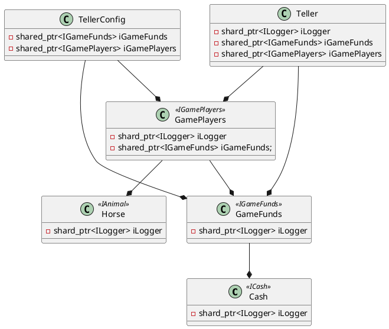

# Horse Track Teller Machine Simulate

Project Files

* HorseRaceTeller.cpp: The main function and manage all elements of the project.
* Teller.cpp: The object of the teller which responsible for listen and react to customer's operation.
* GamePlayers.cpp: The object of the horses that played the racing game.
* GameFunds.cpp: The object of the funds stored in the teller, responsible for customer's payout when they win a bet.
* TellerConfig.cpp : The Configuration of the teller machine, including all the horses play the game and all the funds stored in the machine
* TellerLogger.cpp : The logging object that responsible for display all information to customer.

Unit Test Files

* TellerHorseRaceTest.cpp : Simulated 11 customer's input for positive and negative situations.

Note :

* This project need to be compiled with C++17

Design Diagram

